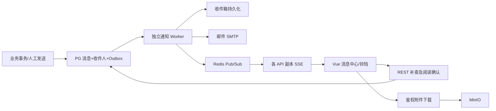

# 消息中心技术详细设计说明书

版本：v1.1；2026-10-09。以下第4至10节保留设计基线；第14节为本次交付的实际实现契约，发生差异时以第14节和代码为准。

## 4. 技术架构

复用 FastAPI、PostgreSQL、Redis、MinIO、SMTP、ClamAV、Prometheus 和审计模块。
Worker 使用独立 Kubernetes Deployment，复用后端镜像，通过独立命令启动。
PG 是消息与发送任务的权威来源；Redis 仅广播 message_changed 及缓存。
不以 Pub/Sub 作为可靠发送队列：其 at-most-once 语义会丢失离线广播。
Worker 使用 FOR UPDATE SKIP LOCKED 批量领取任务，短事务更新租约；网络发送在事务外完成。
进程中断后租约到期可回收。唯一键与幂等校验防止重复站内收件。
站内提交成功不受 SMTP 失败影响；邮件失败单独重试。
生产 API 建议至少2副本；开发集群可以单副本，另做2副本验证。
Redis不可用时消息继续入库，前端降级查询；SMTP不可用时不阻塞业务提交。

## 5. 数据层设计

所有时间以 UTC 保存，前端按用户时区显示；金额或密码不进入消息正文。
使用 SQLAlchemy 模型和项目现有迁移方式，正式迁移脚本独立可重复执行。

| 表 | 核心字段 | 约束与索引 |
|---|---|---|
| notification_messages | id, event_key, category, severity, title, body, sender_id, sender_kind, tenant_id, target_type, target_id, template_code, template_version, status, sent_at, expires_at, recalled_at, created_at | event_key按事件唯一；status+sent_at；tenant_id+created_at |
| notification_recipients | id, message_id, user_id, tenant_context, delivered_at, first_read_at, last_read_at, acknowledged_at, archived_at, deleted_at, updated_at | unique(message_id,user_id)；user_id+deleted_at+created_at；未读部分索引 |
| notification_attachments | id, message_id, file_id, original_name, size, media_type, scan_status, created_at | message_id索引；引用现有 file_objects，不公开桶地址 |
| notification_templates | id, code, version, category, title_template, body_template, email_template, enabled | unique(code,version)；发送后使用已渲染快照 |
| notification_preferences | user_id, category, email_enabled, quiet_hours_json, timezone, updated_at | unique(user_id,category)；紧急规则覆盖免打扰需可见 |
| notification_outbox | id, event_key, message_id, job_type, recipient_id, available_at, status, lease_owner, lease_until, attempts, last_error, completed_at | 幂等键唯一；status+available_at |
| notification_deliveries | id, recipient_id, channel, destination_snapshot, status, smtp_accepted_at, provider_delivered_at, attempt_count, last_error | recipient_id+channel；不记录SMTP密码 |
| notification_delivery_attempts | id, delivery_id, attempt_no, started_at, finished_at, result, error_code, sanitized_error, message_id_header | unique(delivery_id,attempt_no) |

读取状态以 first_read_at 判断，删除和归档为独立字段，避免互相覆盖。
delivered_at 表示站内收件箱可查询的时刻，不等于 SSE 推送成功。
SMTP成功表示邮件服务器接受，状态 smtp_accepted；没有邮件服务商回调不能声称进入收件箱。
provider_delivered_at 留空直到有可信回执；不使用追踪像素伪造用户阅读。
站内 first_read_at / last_read_at 在用户打开详情时记录，不在列表加载或 SSE 推送时记录。
acknowledged_at 与阅读独立，只有本人显式确认紧急消息才能设置。

## 6. 生命周期与一致性

消息主体：draft -> queued -> sent；draft/queued可取消；sent可撤回，撤回原因必填。
收件人：入箱未读 -> 阅读；紧急同时保留未确认状态 -> 明确确认；独立支持归档/删除/恢复。
发送任务：pending -> leased -> completed；失败 -> retry_pending -> leased；超过次数 -> dead。
可重试邮件默认初次发送+3次重试，间隔10秒，可配置；永久性无效地址直接失败。
SMTP超时可能已经发送，无法承诺邮件 exactly-once；保持稳定 Message-ID，台账注明重复发送风险。
到期后不再提醒及发邮件，收件箱不默认展示；按配置清理，保留必要审计摘要。
未确认紧急到期需要运营待办展示，不通过延长无限保留正文解决。
未读统计必须在全库过滤本人、有效、未删除、未归档、未撤回消息，不只统计当前页。
阅读、确认、删除、恢复均幂等；批量操作全部检查本人收件记录，越权项拒绝且不部分提交。
全部已读/批量删除采用服务器截止时间，不能误处理操作发生后新到的消息。

## 9. 接口边界

保留当前 /notifications 路径兼容，详情ID定义为本人收件记录ID。
GET /notifications：q/category/severity/read/acknowledged/folder/enterprise_id/start/end/page/page_size。
返回 items,total,page,page_size,unread,unacknowledged_urgent,server_time。
GET /notifications/summary：全量未读、未确认紧急、最近消息。
GET /notifications/{id}：不自动记读；POST /{id}/read：原子设置首次时间并更新最后时间。
POST /{id}/acknowledge；POST /{id}/archive；DELETE /{id}；POST /{id}/restore。
POST /notifications/batch-actions：ids 或受控 filter+cutoff，action，批量上限200。
GET /notifications/stream：鉴权SSE；GET /{id}/attachments/{file_id}：鉴权流式下载。
POST /admin/notifications、GET /admin/notifications、POST /{id}/send、POST /{id}/recall、GET /{id}/deliveries。
企业同类接口使用 /enterprise/notifications，并强制 enterprise_id 与管理员Membership一致。
POST发送携带 Idempotency-Key；接受异步任务返回202及消息ID。
GET/PATCH /admin/settings/message-center；GET/PATCH /notifications/preferences。
400非法参数；403权限；404无权限对象；409生命周期冲突；413附件超限；422字段错误；429频率限制。
站内与邮件适配器统一 send(context) -> delivery_result，短信适配器明确 not_configured。

## 10. 迁移与部署

历史单表逐条迁入消息主体与收件人，记录 legacy_notification_id 唯一映射；
历史已读状态保留，未知送达/阅读时间为空，不编造时间。
迁移先扩展结构、回填、核对条数、切换读写；回滚窗口保留旧表，避免运行时双写失去一致性。
迁移有独立锁，可重复执行且不重置阅读或任务完成状态。
已有 notify_platform_role 改为调用统一领域服务，使用原业务事务写入Outbox；不在审核请求内发送SMTP。
market命名空间增加 market-notification-worker Deployment 和清理 CronJob；已有Redis/PG/MinIO复用。
测试SMTP单独Service；监控发送失败、dead任务、最老积压时长、worker心跳、SSE连接、Redis降级。
部署镜像标签仍采用 YYYYMMDDHHMMSS-GitSha。
开发进度只有通过验证才完成；不以代码存在或Pod运行替代验收。

## 13. 技术依据

- Redis官方Pub/Sub文档：https://redis.io/docs/latest/develop/use-cases/pub-sub/ ，离线丢广播，使用PG补查。
- PostgreSQL官方SELECT文档：https://www.postgresql.org/docs/current/sql-select.html ，SKIP LOCKED支持队列消费者竞争。
- MDN SSE文档：https://developer.mozilla.org/en-US/docs/Web/API/Server-sent_events/Using_server-sent_events ，心跳、事件及重连机制。

## 14. 实际实现契约

- 领域服务位于 backend/app/message_center.py，由 main.py 注入现有数据库、身份、审计及存储依赖。业务事务同时写入消息、收件记录及渠道任务；提交后独立 Worker 执行外部 I/O。
- notification_deliveries 合并事务 Outbox 与渠道发送台账，不额外创建 notification_outbox；唯一键为消息、用户、渠道。任务状态为 pending/leased/accepted/failed/skipped，结果、租约及重试次数独立保存。notification_delivery_attempts 记录每次领取及发送结果，以租约令牌防止旧 Worker 覆盖新结果。
- notification_messages 保存已渲染标题、正文及唯一 event_key；未另行实现模板版本表。系统配置使用 notification_ 前缀的 SystemSetting，个人邮件偏好为用户级开关，未提供分类免打扰时段。
- notification_attachments 保存私有 MinIO 对象元数据，notification_message_attachments 关联消息与附件；附件先进行 ClamAV 检测。单条消息最多5个附件，默认单文件20MB，可配置。下载要求上传者身份或有效收件权限，并记录审计。
- notification_expired_urgent 保存已清理紧急消息的运营待办摘要，管理员填写原因结案，不等同于收件人确认消息。
- 实际 API 统一位于 /api/notifications：list、summary、stream、read-all、batch-actions、send、sent、preferences、settings、attachments、delivery-health、deliveries/{id}/retry、expired-urgent/{id}/resolve；详情及操作使用收件记录ID。企业与平台发送共用接口，后端按角色及企业成员关系校验范围。
- 人工发送用请求 event_key 进行幂等校验：相同键及相同内容返回原结果，冲突返回409。每次最多500名收件人，批量收件操作最多200条；全部已读使用服务器截止时间。
- 邮件主题、正文采用安全字符串模板，仅支持 title/content/platform_url 变量；HTML转义，主题禁止换行。默认初次发送后最多重试3次，间隔10秒；接受SMTP发送不表示邮件到达收件箱或被阅读。
- 消息主体为 draft/sent/recalled；收件阅读、确认、归档和软删除分别记录。仅当前用户显式确认紧急消息；他人的阅读、删除不影响其他收件人。
- Redis只广播变更提示；SSE使用Bearer请求头，不在URL传令牌；每15秒校验身份并补查摘要。断线后按配置轮询，默认30秒。读取数据库释放连接后才进入长连接循环。
- 部署组件实际命名为 message-center-worker（2副本）、message-center-cleanup（每日UTC 03:23）、market-mailpit。开发邮件由内部Mailpit捕获，未接外部真实邮件收件箱。
- /metrics/notifications 只提供聚合监控指标（内部8000端口，不带/api前缀）。Prometheus规则覆盖发送失败、积压及指标不可达；外部告警接收渠道需由生产运维另行配置。
- 历史迁移保留legacy映射，可重复运行，不生成历史邮件；未知阅读时间不补造。默认180天保留期应用于新消息；修改配置不会自动重写已存在消息的到期时间。
- 多副本、租约恢复和幂等以真实PG隔离schema验证，SMTP/MinIO/Redis/ClamAV以开发服务验证；不宣称邮件 exactly-once 或生产容量压测已完成。
