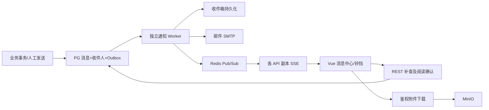

# 消息中心需求、功能设计与开发计划

版本：v1.0，用户确认基线；日期：2026-10-09。
范围：本文件是待开发设计，不表示以下能力已经实现或部署。

## 1. 当前实现与缺口

代码检查基于 backend/app/main.py、frontend/src/App.vue。
现有 PlatformNotification 单表包含收件人、角色、标题、正文、业务对象、unread/read 和创建时间。
产品提交及质量、安全、运营阶段切换已调用 notify_platform_role；通知创建与业务使用同一个数据库事务。
GET /api/notifications 仅查询最近100条，未读数在这100条中计算，不能代表全部未读。
POST /api/notifications/{id}/read 已校验收件人，但没有阅读时间和操作审计。
顶部铃铛没有点击处理、真实未读计数及数据加载。
现有 SMTP 用于激活/邀请邮件，短信是预留能力；邮件配置不等于消息中心邮件渠道已经实现。
未实现消息中心、可靠异步邮件、附件授权、紧急确认、分页筛选、删除恢复、SSE、通知管理和监控。
业务审核通知当前发送给 business_reviewer 与系统管理员；需要按当前业务审核权限补齐 product_manager。

## 2. 已确认需求

- 首期站内消息与邮件，短信保留适配接口。
- 系统自动通知；系统管理员手工发送；企业超级管理员及企业管理员仅向本企业成员发送。
- 按收件人软删除，不影响其他收件人。
- 默认保留180天，系统配置可修改。
- SSE、Redis Pub/Sub、断线后轮询补偿。
- 支持 MinIO 附件。
- 普通、重要、紧急三级；紧急持续提醒，需要明确确认。
- 记录站内送达、首次阅读、最后阅读时间；保留审计证据。

## 3. 首期执行默认值

以下为可配置的实施默认值，用户可调整，不作为阻塞开发的前置审批：
附件每个20MB、每条最多5个，允许 PDF、TXT、CSV、DOCX、XLSX、PNG、JPG；
文件执行类型检查和 ClamAV 扫描，未通过不可发送。扫描失败保留隔离状态。
站内通知默认开启；有已验证邮箱且用户允许该类别邮件时发送邮件；紧急通知有已验证邮箱时默认发送。
未验证邮箱、无邮箱、删除或禁用账号的邮件分别记录 skipped 原因；发送前再次校验收件人状态。
邮件不附加原始业务文件，仅给登录后的平台详情链接，附件下载仍需鉴权。
系统管理员拥有平台手工发送权限；七类固定平台角色仅收件，平台运营代发权限作为后续可配置权限。
企业普通成员只能管理自己的收件箱；多企业管理员必须选择发送企业，范围不能跨企业。
未实名用户可查看本人通知，不因此获得产品、订单或管理权限。
普通和重要消息可直接软删除；未确认紧急消息先确认，才能删除或归档。
软删除消息在保留期内可从回收站恢复；180天以发送时间起算，不因阅读、确认或恢复重新计时。
支持立即发送，首期预留定时字段，定时发送界面放在第二阶段。
普通和重要提醒不强制弹框；紧急条幅不遮挡业务操作。

## 4. 技术架构

复用 FastAPI、PostgreSQL、Redis、MinIO、SMTP、ClamAV、Prometheus 和审计模块。
Worker 使用独立 Kubernetes Deployment，复用后端镜像，通过独立命令启动。
PG 是消息与发送任务的权威来源；Redis 仅广播 message_changed 及缓存。
不以 Pub/Sub 作为可靠发送队列：其 at-most-once 语义会丢失离线广播。
Worker 使用 FOR UPDATE SKIP LOCKED 批量领取任务，短事务更新租约；网络发送在事务外完成。
进程中断后租约到期可回收。唯一键与幂等校验防止重复站内收件。
站内提交成功不受 SMTP 失败影响；邮件失败单独重试。
生产 API 建议至少2副本；开发集群可以单副本，另做2副本验证。
Redis不可用时消息继续入库，前端降级查询；SMTP不可用时不阻塞业务提交。

## 5. 数据层设计

所有时间以 UTC 保存，前端按用户时区显示；金额或密码不进入消息正文。
使用 SQLAlchemy 模型和项目现有迁移方式，正式迁移脚本独立可重复执行。

| 表 | 核心字段 | 约束与索引 |
|---|---|---|
| notification_messages | id, event_key, category, severity, title, body, sender_id, sender_kind, tenant_id, target_type, target_id, template_code, template_version, status, sent_at, expires_at, recalled_at, created_at | event_key按事件唯一；status+sent_at；tenant_id+created_at |
| notification_recipients | id, message_id, user_id, tenant_context, delivered_at, first_read_at, last_read_at, acknowledged_at, archived_at, deleted_at, updated_at | unique(message_id,user_id)；user_id+deleted_at+created_at；未读部分索引 |
| notification_attachments | id, message_id, file_id, original_name, size, media_type, scan_status, created_at | message_id索引；引用现有 file_objects，不公开桶地址 |
| notification_templates | id, code, version, category, title_template, body_template, email_template, enabled | unique(code,version)；发送后使用已渲染快照 |
| notification_preferences | user_id, category, email_enabled, quiet_hours_json, timezone, updated_at | unique(user_id,category)；紧急规则覆盖免打扰需可见 |
| notification_outbox | id, event_key, message_id, job_type, recipient_id, available_at, status, lease_owner, lease_until, attempts, last_error, completed_at | 幂等键唯一；status+available_at |
| notification_deliveries | id, recipient_id, channel, destination_snapshot, status, smtp_accepted_at, provider_delivered_at, attempt_count, last_error | recipient_id+channel；不记录SMTP密码 |
| notification_delivery_attempts | id, delivery_id, attempt_no, started_at, finished_at, result, error_code, sanitized_error, message_id_header | unique(delivery_id,attempt_no) |

读取状态以 first_read_at 判断，删除和归档为独立字段，避免互相覆盖。
delivered_at 表示站内收件箱可查询的时刻，不等于 SSE 推送成功。
SMTP成功表示邮件服务器接受，状态 smtp_accepted；没有邮件服务商回调不能声称进入收件箱。
provider_delivered_at 留空直到有可信回执；不使用追踪像素伪造用户阅读。
站内 first_read_at / last_read_at 在用户打开详情时记录，不在列表加载或 SSE 推送时记录。
acknowledged_at 与阅读独立，只有本人显式确认紧急消息才能设置。

## 6. 生命周期与一致性

消息主体：draft -> queued -> sent；draft/queued可取消；sent可撤回，撤回原因必填。
收件人：入箱未读 -> 阅读；紧急同时保留未确认状态 -> 明确确认；独立支持归档/删除/恢复。
发送任务：pending -> leased -> completed；失败 -> retry_pending -> leased；超过次数 -> dead。
可重试邮件默认初次发送+3次重试，间隔10秒，可配置；永久性无效地址直接失败。
SMTP超时可能已经发送，无法承诺邮件 exactly-once；保持稳定 Message-ID，台账注明重复发送风险。
到期后不再提醒及发邮件，收件箱不默认展示；按配置清理，保留必要审计摘要。
未确认紧急到期需要运营待办展示，不通过延长无限保留正文解决。
未读统计必须在全库过滤本人、有效、未删除、未归档、未撤回消息，不只统计当前页。
阅读、确认、删除、恢复均幂等；批量操作全部检查本人收件记录，越权项拒绝且不部分提交。
全部已读/批量删除采用服务器截止时间，不能误处理操作发生后新到的消息。

## 7. 应用层详细功能

### 7.1 个人消息中心

左侧菜单“消息中心”，未实名用户亦可访问。
Tab：收件箱、未读、重要/紧急、已归档、回收站；类别按审核、认证、企业、订单、交付、清算、API/SaaS、安全、SLA、公告过滤。
列表：复选框、未读标记、等级、标题与摘要、类别、发送方、企业上下文、发送时间、操作。
筛选：关键词、阅读状态、确认状态、等级、类别、企业、日期；服务端分页20/50/100。
操作：阅读详情、标记已读、归档、删除、恢复、批量操作、按筛选全部已读。
详情显示正文、来源对象、发送/送达/首次阅读/最后阅读/确认时间、附件、业务跳转。
打开详情仅本人记读；列表预览不记读；失败不显示成功提示。
按业务对象类型白名单生成站内跳转，不信任消息提供的任意URL。
目标被删除或失去权限时，保留通知正文快照，跳转提示对象不可访问，不提升权限。

### 7.2 提醒和实时更新

顶部铃铛显示真实未读计数（超过99显示99+），无未读无红点；展示最近10条与入口。
紧急条幅显示未确认条数及标题，可阅读和明确“确认收到”。
阅读不关闭紧急提醒；多端确认或删除后同步角标及条幅。
每用户一个SSE连接，前端跨Tab可用 BroadcastChannel 共享更新事件。
采用支持 Authorization 请求头的 fetch SSE 客户端，复用现有 Bearer 会话，不把长期JWT放查询串。
15秒心跳、断线退避重连、30秒轮询降级；重新连接、页面恢复焦点均补查未读及紧急列表。
SSE只推 message_changed 与计数失效信号，客户端从数据库API补查；不承诺事件逐条回放。
退出登录关闭连接；令牌过期/禁用后断开；订阅仅当前用户频道，严禁客户端指定其他用户频道。
Nginx针对 stream 禁用代理缓冲及缓存，读取超时覆盖心跳；REST保持现有配置。

### 7.3 人工发送与发件记录

系统管理员：指定用户、企业、平台角色、全平台；选择分类、等级、站内/邮件、正文与附件。
企业管理员：指定本企业成员或全部本企业有效成员；超级管理员使用同等发送范围。
草稿预览展示收件人数量、没有验证邮箱数量、附件状态；提交必须明确发送。
收件人在发送事务中固定，发送后新加入成员不自动收到历史定向消息。
防止利用ID提交跨企业用户；去重多角色/多部门命中同一用户。
发件记录按发送人及授权企业查询，显示入箱人数、邮件接受/失败/跳过人数、阅读和确认人数。
平台管理员不默认取得其他人的收件箱权限；统计和正文访问须在发送管理权限内。
撤回删除收件视图及后续提醒，已发邮件无法撤回；撤回后链接显示已撤回。
附件不能使用未授权的其它产品文件；复用已有文件必须重新检查授权和关联。

### 7.4 系统设置

“系统设置”新增“消息中心”Tab：保留天数、附件限额、重试次数/间隔、轮询间隔、模板、渠道开关。
复用已有SMTP配置，密码由Secret/现有安全设置保存，前端不返回明文。
测试邮件仅显式点击测试发送；部署与自动测试默认使用本地测试SMTP，禁止向真实用户批量测试。
用户可调整普通/重要类别邮件偏好；紧急通知显示默认强制邮件规则。
邮件正文为安全模板，变量转义；禁止正文任意HTML脚本；发送错误脱敏。

## 8. 业务通知矩阵

| 事件 | 收件人 | 级别/渠道 | 业务链接 |
|---|---|---|---|
| 产品进入业务审核 | 数据产品经理、允许业务审核角色、系统管理员 | 重要/站内+邮件 | 产品审核 |
| 产品进入质量/安全/运营审核 | 对应审核角色、系统管理员，去重 | 重要/站内+邮件 | 产品详情 |
| 审核拒绝/发布/撤回 | 产品提供方管理员及提交人 | 重要/站内+邮件 | 产品 |
| 个人/企业实名结果 | 申请人；企业结果含企业超级管理员 | 重要/站内+邮件 | 用户与企业 |
| 邀请/拒绝/加入 | 被邀用户、发起人按事件分别通知 | 普通/站内+邮件 | 邀请 |
| 订单支付/取消/退款完成 | 购买人、相关企业管理员、提供方授权人员 | 重要/站内+邮件 | 订单 |
| 自动交付失败/人工接管 | 交付监控、系统管理员、订单授权人员 | 紧急/站内+邮件 | 交付 |
| 线下履约待验收 | 购买人及购买企业管理员 | 重要/站内+邮件 | 订单验收 |
| 清算待确认/调整提案/拒绝/支付 | 有权确认的参与方及财务清算 | 重要/站内+邮件 | 清算单/批次 |
| API额度预警/耗尽 | 购买授权主体管理员或个人所有者 | 重要/站内+邮件 | 订单凭据 |
| SaaS订阅到期预警 | 订阅购买方授权人员 | 重要/站内+邮件 | 订阅 |
| 安全自动下架/SLA违约 | 安全合规、运营、系统管理员及受影响所有者 | 紧急/站内+邮件 | 安全报告/SLA |

通知对象必须复用业务访问权限；清算消息不得向无关企业泄露金额。
重复重试、定时检查同一阈值使用 event_key 去重；恢复正常后下一次独立异常可再次通知。
紧急确认代表收到提醒，不代表审核通过、交付验收或故障已解决。

## 9. 接口边界

保留当前 /notifications 路径兼容，详情ID定义为本人收件记录ID。
GET /notifications：q/category/severity/read/acknowledged/folder/enterprise_id/start/end/page/page_size。
返回 items,total,page,page_size,unread,unacknowledged_urgent,server_time。
GET /notifications/summary：全量未读、未确认紧急、最近消息。
GET /notifications/{id}：不自动记读；POST /{id}/read：原子设置首次时间并更新最后时间。
POST /{id}/acknowledge；POST /{id}/archive；DELETE /{id}；POST /{id}/restore。
POST /notifications/batch-actions：ids 或受控 filter+cutoff，action，批量上限200。
GET /notifications/stream：鉴权SSE；GET /{id}/attachments/{file_id}：鉴权流式下载。
POST /admin/notifications、GET /admin/notifications、POST /{id}/send、POST /{id}/recall、GET /{id}/deliveries。
企业同类接口使用 /enterprise/notifications，并强制 enterprise_id 与管理员Membership一致。
POST发送携带 Idempotency-Key；接受异步任务返回202及消息ID。
GET/PATCH /admin/settings/message-center；GET/PATCH /notifications/preferences。
400非法参数；403权限；404无权限对象；409生命周期冲突；413附件超限；422字段错误；429频率限制。
站内与邮件适配器统一 send(context) -> delivery_result，短信适配器明确 not_configured。

## 10. 迁移与部署

历史单表逐条迁入消息主体与收件人，记录 legacy_notification_id 唯一映射；
历史已读状态保留，未知送达/阅读时间为空，不编造时间。
迁移先扩展结构、回填、核对条数、切换读写；回滚窗口保留旧表，避免运行时双写失去一致性。
迁移有独立锁，可重复执行且不重置阅读或任务完成状态。
已有 notify_platform_role 改为调用统一领域服务，使用原业务事务写入Outbox；不在审核请求内发送SMTP。
market命名空间增加 market-notification-worker Deployment 和清理 CronJob；已有Redis/PG/MinIO复用。
测试SMTP单独Service；监控发送失败、dead任务、最老积压时长、worker心跳、SSE连接、Redis降级。
部署镜像标签仍采用 YYYYMMDDHHMMSS-GitSha。
开发进度只有通过验证才完成；不以代码存在或Pod运行替代验收。

## 11. 分阶段任务分解

所有任务初始待开发；负责人是职责分工，并不表示已启动独立Agent。

| 编号 | 负责人 | 任务与验收 | 依赖 | 阶段 |
|---|---|---|---|---|
| MSG-ARC-001 | 主Agent | 已确认需求、数据/接口/权限基线和验收矩阵归档 | 无 | 0 |
| MSG-BE-001 | 后端 | 消息/收件人/附件模型、唯一键及索引 | MSG-ARC-001 | 1 |
| MSG-BE-002 | 后端 | 历史迁移重复运行、数量状态核对、回滚脚本 | MSG-BE-001 | 1 |
| MSG-BE-003 | 后端 | 事件幂等、收件人解析、事务Outbox | MSG-BE-001 | 1 |
| MSG-BE-004 | 后端 | 详情分页过滤和准确全量计数 | MSG-BE-003 | 1 |
| MSG-BE-005 | 后端 | 首次/最后阅读、确认、软删、归档恢复、批量截止时间 | MSG-BE-004 | 1 |
| MSG-BE-006 | 后端 | 管理员与企业发送、草稿、撤回和范围校验 | MSG-BE-003 | 2 |
| MSG-BE-007 | 后端 | 安全模板及SMTP独立台账、偏好和跳过原因 | MSG-BE-003 | 2 |
| MSG-BE-008 | 后端 | Worker租约、10秒3次重试、失败任务恢复 | MSG-BE-007 | 2 |
| MSG-BE-009 | 后端 | MinIO附件上传扫描、关联鉴权、下载留痕 | MSG-BE-001 | 2 |
| MSG-BE-010 | 后端 | SSE鉴权、多副本广播、心跳和断线补查契约 | MSG-BE-004 | 2 |
| MSG-BE-011 | 后端 | 保留期清理、系统设置、渠道偏好、紧急确认策略 | MSG-BE-005,MSG-BE-008 | 3 |
| MSG-BE-012 | 后端 | 审核与实名企业事件接入，补齐数据产品经理 | MSG-BE-003 | 3 |
| MSG-BE-013 | 后端 | 订单退款、交付、清算事件接入与去重 | MSG-BE-003 | 3 |
| MSG-BE-014 | 后端 | API额度、SaaS到期、安全和SLA事件接入 | MSG-BE-003 | 3 |
| MSG-FE-001 | 前端 | 消息列表筛选分页、详情和业务权限跳转 | MSG-BE-004 | 1 |
| MSG-FE-002 | 前端 | 铃铛真实计数、预览、未实名入口、紧急条幅 | MSG-BE-005 | 1 |
| MSG-FE-003 | 前端 | 阅读确认、批量处理、回收站及附件 | MSG-BE-005,MSG-BE-009 | 2 |
| MSG-FE-004 | 前端 | 平台/企业发送表单、预览与发件台账 | MSG-BE-006 | 2 |
| MSG-FE-005 | 前端 | fetch SSE客户端、重连、轮询、多端同步 | MSG-BE-010 | 2 |
| MSG-FE-006 | 前端 | 系统消息设置和个人邮件偏好 | MSG-BE-011 | 3 |
| MSG-OPS-001 | 部署测试 | Worker、测试SMTP、代理SSE、Secret与迁移部署 | MSG-BE-008,MSG-BE-010 | 2 |
| MSG-OPS-002 | 部署测试 | 清理CronJob、监控、失败告警和故障恢复 | MSG-BE-011,MSG-OPS-001 | 3 |
| MSG-QA-001 | 部署测试 | 跨用户/企业/角色/多部门权限、附件越权测试 | MSG-BE-006,MSG-BE-009,MSG-FE-004 | 3 |
| MSG-QA-002 | 部署测试 | 阅读确认删除恢复、全量计数与多端并发测试 | MSG-FE-003,MSG-FE-005 | 3 |
| MSG-QA-003 | 部署测试 | Redis/SMTP故障、worker崩溃、租约恢复及重复发送验证 | MSG-OPS-001 | 3 |
| MSG-QA-004 | 部署测试 | 审核至交付清算的业务通知端到端、邮件中文模板 | MSG-BE-012,MSG-BE-013,MSG-BE-014 | 3 |
| MSG-ARC-002 | 主Agent | 验收报告、部署与任务状态复核 | MSG-QA-001,MSG-QA-002,MSG-QA-003,MSG-QA-004 | 3 |

共28项：主Agent2项、后端14项、前端6项、部署2项、专项测试4项。

阶段0：设计归档与任务建立；阶段1：站内闭环；阶段2：邮件、附件、实时推送、发送管理；
阶段3：业务接入、清理、故障验证、验收。前后端按已冻结接口可并行。
不提前宣称工期或完成比例；任务依赖完成后才标记进行中，阻塞要记录实际原因。

## 12. 必须通过的验收场景

1. 101条以上未读仍准确计数；分页筛选不改变全局未读值。
2. 业务提交回滚不产生通知；事件重复处理仅生成一份收件记录。
3. 同一用户多企业多部门命中同一消息只收一次；保留来源企业上下文。
4. 用户A不能读取、确认、批量删除用户B消息；企业管理员不能向外企业发送。
5. 阅读紧急消息后仍提醒；点击确认后各端解除；不更改业务审批状态。
6. 单人软删除不影响另一收件人；恢复保留首次阅读与确认时间。
7. SMTP失败站内消息正常；初次+3次重试台账完整；无验证邮箱明确跳过。
8. 邮件中文正常、密码不进入日志、链接要求登录、附件按收件关系授权。
9. Redis离线期间消息入库；重连与轮询可补查，计数和紧急列表最终一致。
10. API两副本、worker两副本不会重复创建站内消息；worker故障租约恢复。
11. 过期、撤回、删除、禁用账号不继续提醒；未确认紧急过期留下运营待办。
12. 历史迁移可重复，已读不重置；邮件接受不冒充送达或阅读回执。
13. 至少完成产品四阶段审核、拒绝、订单支付、交付失败、清算提案、SLA预警全链路。
14. 浏览器桌面/移动界面无溢出，铃铛、条幅、批量按钮与平台现有风格一致。
建议性能目标：100用户模拟在线，消息提交后站内可见<=2秒，在线提醒P95<=5秒；
数据规模10万收件记录时查询P95<=500ms。记录实测环境，不将目标写成已达成结果。

## 13. 技术依据

- Redis官方Pub/Sub文档：https://redis.io/docs/latest/develop/use-cases/pub-sub/ ，离线丢广播，使用PG补查。
- PostgreSQL官方SELECT文档：https://www.postgresql.org/docs/current/sql-select.html ，SKIP LOCKED支持队列消费者竞争。
- MDN SSE文档：https://developer.mozilla.org/en-US/docs/Web/API/Server-sent_events/Using_server-sent_events ，心跳、事件及重连机制。

